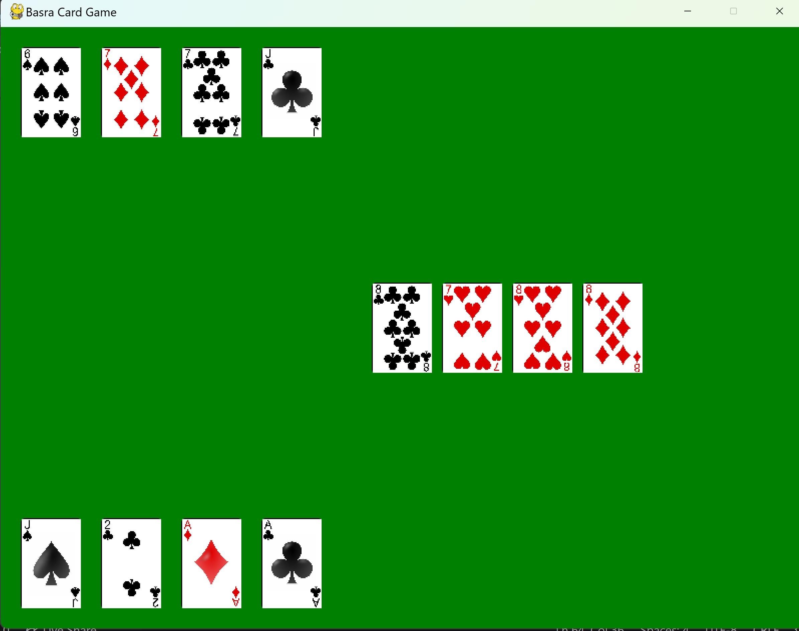

# Basra Card Game

A 2-player **Basra** card game implemented in **Python + Pygame**, featuring classic capture rules, scoring, and a simple clickable GUI.

## Demo
- Screenshot:
  

## Features
- **Two-player local** gameplay (Player 1 bottom, Player 2 top) with turn switching
- **Capture rules**
  - **Match capture**: capture any table cards with the same value as the played card
  - **Sum capture** (numeric cards): captures combinations of table cards whose values sum to the played card
  - **Jack capture**: Jack captures **all** cards on the table
- **Basra**: +10 points for clearing the table with a **non-Jack** capture
- **Scoring**
  - +1 per **Ace** or **Jack**
  - +2 for **2 of Clubs**
  - +3 for **10 of Diamonds**
  - +3 bonus for capturing **27+ cards**
- Auto dealing:
  - 4 cards per player + 4 on table at start
  - Ensures the initial table cards don’t include a Jack
- Includes a **terminal version** (play by entering card indices)

## Tech Stack
- **Python**
- **Pygame** (rendering + input + game loop)

## Architecture
- `basra.py` — core game engine (turns, capture logic, Basra bonus, dealing rounds, end-game scoring) 
- `card.py` — `Card` + `Deck` (deck creation, shuffle, deal hand/ground, initial-table Jack handling)
- `player.py` — `Player` state (hand, captured pile, scoring rules)
- `gui.py` — Pygame UI (draw hands/table, detect card clicks, drive game loop)
- `main.py` — terminal/CLI gameplay loop (prints state, plays by index input)
- `Playing-cards/` — card image assets (PNG deck) *(used by the GUI)*

## Getting Started

### Prerequisites
- Python 3.x
- Pygame

### Install & Run (GUI)
```bash
# create venv (optional)
python -m venv .venv
source .venv/bin/activate  # macOS/Linux
# .venv\Scripts\activate   # Windows

# install deps
pip install pygame

# run the Pygame UI
python gui.py
```
### Run (Terminal Mode)
```bash
python main.py
```

## Notes on assets
The GUI loads card images from a folder path in gui.py (currently cards_png/...).
If your repo stores images under Playing-cards/ instead, either:
- rename/move the folder to match cards_png/, or
- update the image load path in gui.py to point to your assets directory.
